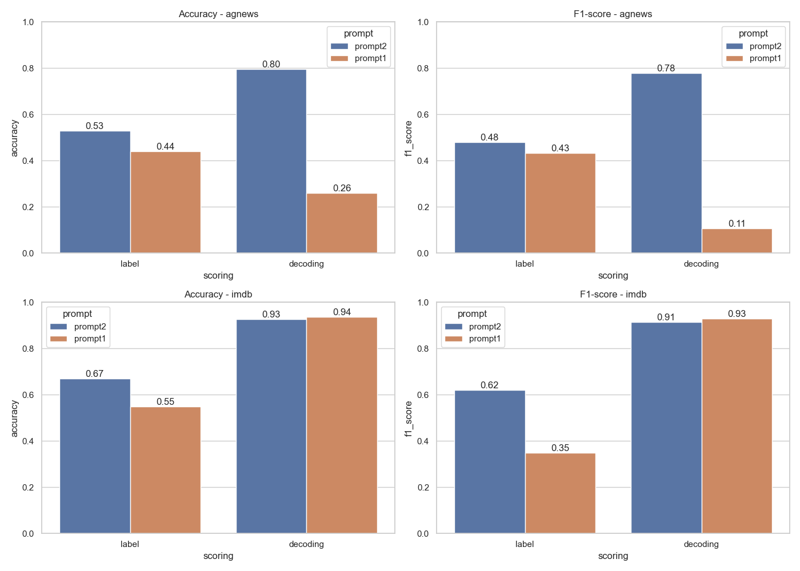

# Zero-Shot Text Classification with Small Language Models

This project aims to evaluate the capability of small language models (such as LaMini-Flan-T5-783M) to solve **zero-shot** classification tasks, that is, without training on the target data.

link to the repository : https://github.com/DessalinesDarryl/zero-shot-small-lms

---

## 1. Objective

The goal is to measure to what extent reduced models like `T5` can generalize to text classification tasks simply from a well-formulated prompt, without fine-tuning.

---

## 2. Methodology

The methodology follows these steps:

### a. Selection of classification datasets

Three datasets are used:

| Dataset | Task                | Number of classes | Quick description                                 |
|---------|---------------------|-------------------|---------------------------------------------------|
| imdb    | Sentiment Analysis  | 2                 | Classify a movie review as positive or negative   |
| agnews  | Topic Analysis      | 4                 | Classify the topic of an article as world, sports, business or sci/tech                |

### b. Creation of prompt files

For each dataset, a JSON file contains:

- A `prompt` with placeholders `{TEXT}` and `{LABEL}`.
- A `verbalizer` dictionary listing the labels and their synonyms.
- A list of `samples` containing labeled texts.

These files are saved in the `prompts/` folder.

### c. Two scoring methods

The `run_experiment.py` script allows evaluation using two strategies:

1. **Decoding scoring** (`--scoring decoding`):
   - The model receives a prompt.
   - It generates a free-form output.
   - The generated output is compared to the `verbalizer` synonyms.

2. **Label scoring** (`--scoring label`):
   - A prompt is generated for each possible label.
   - The loss associated with each prompt is computed.
   - The label with the lowest loss (highest likelihood) is selected.

### d. Performance evaluation

The following metrics are computed:

- Accuracy  
- F1-score (with `"binary"` average for binary tasks, `"weighted"` otherwise)  
- Baselines:
  - Majority class prediction
  - Uniform random prediction

### e. Results saving

Results are saved in the `results/` folder as `.json` files.

---

## 3. Usage

### a. Installation

```bash
python -m venv .venv
source .venv/bin/activate
pip install -r requirements.txt
```

### b. Prompt creation
```
Prompts are generated from the file notebooks/analysis.ipynb
```

### c. Running the classifications
```
# For the sms dataset 
python run_experiment.py --dataset sms --scoring decoding --max_samples 20 --save_results
python run_experiment.py --dataset sms --scoring label --max_samples 20 --save_results
```
```
# For the imdb dataset
python run_experiment.py --dataset imdb --scoring decoding --max_samples 20 --save_results
python run_experiment.py --dataset imdb --scoring label --max_samples 20 --save_results
```
```
# For the emotion dataset
python run_experiment.py --dataset emotion --scoring decoding --max_samples 20 --save_results
python run_experiment.py --dataset emotion --scoring label --max_samples 20 --save_results
```
---
## 4. Results



The results obtained on the AGNews and IMDB datasets provide several insights regarding the impact of the prompt and scoring method on zero-shot classification performance with a medium-sized model like LaMini-Flan-T5-783M.

### Impact of the prompt
On both datasets, prompt 2 consistently yields better results than prompt 1, both in terms of accuracy and F1-score. This improvement is particularly noticeable for the AGNews dataset with the decoding scoring method, where prompt 2 reaches an F1-score of 0.78, compared to just 0.11 for prompt 1. This shows that prompt formulation has a crucial impact on prediction quality, especially when the model has to generate an open-ended answer (as in decoding).

On IMDB, the performance is higher and more stable, particularly with the decoding method, where both prompts achieve F1-scores above 0.90. This may be due to the nature of the dataset (binary and opinion-focused), which makes the task easier for the model, even with less optimized prompts.

### Comparison of scoring methods
Overall, the decoding method achieves the best performance when the prompt is well designed (e.g., prompt 2 on AGNews and IMDB). However, it is also more sensitive to prompt formulation, as shown by the drastic drop in scores when the prompt is poorly crafted (e.g., prompt 1 on AGNews: F1 = 0.11).

In contrast, the label method is more robust: even with a less effective prompt, performance remains more stable. However, it often hits a performance ceiling lower than that of decoding with a good prompt.

---

## Conclusion
In this study, we explored the capabilities of small language models (notably LaMini-Flan-T5-783M) to perform zero-shot text classification tasks, focusing on two major variables: the choice of prompt and the scoring method.

Our experiments on AGNews and IMDB show that model performance varies significantly depending on the prompt used. A well-formulated prompt can lead to significant score improvements, particularly with the decoding method, where we sometimes observe over 50-point increases in F1-score between a naive and an optimized prompt. This confirms the importance of prompt engineering in zero-shot approaches, as emphasized in the reference paper.

Regarding the scoring method, our results show a slight advantage for decoding when combined with a good prompt. However, the label method proves to be more robust, less sensitive to prompt formulation, but typically yielding more modest performance. This observation contrasts slightly with the article’s conclusion, which suggests that the choice of scoring function is not a decisive factor. It is possible that the effect is more noticeable on specific datasets or models, as is the case here.

Finally, our results fully support the main conclusion of the article: small models can compete with, and even surpass, large models on certain classification tasks, provided they are effectively guided with well-designed prompts. This opens the door to more resource-efficient approaches, particularly relevant in contexts where computational power is limited.